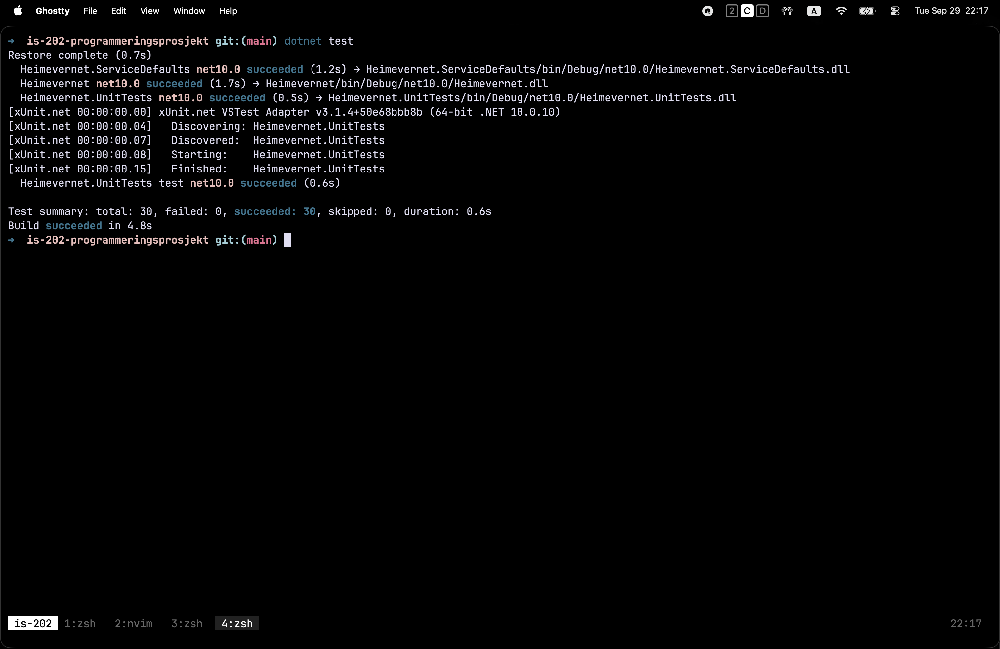

# IS-202 Programmeringsprosjekt

Kriseberedskap – ressurs- og behovsportal for Totalforsvaret. Løsningen kobler
behov fra offentlige aktører (kommune, politi, brann, helse, Sivilforsvaret,
Forsvaret/Heimevernet) med tilgjengelige ressurser fra privatpersoner,
bedrifter og frivillige organisasjoner ved større hendelser eller kriser.
Appen er laget for to brukergrupper: offentlige aktører som registrerer behov,
og ressursleverandører som registrerer hva de kan tilby.

## Forutsetninger

- [.NET 10 SDK](https://dotnet.microsoft.com/download/dotnet/10.0)
- [Docker Desktop](https://www.docker.com/products/docker-desktop/) (må være startet)
- Git

## Kom i gang

1. Klon repoet:
   ```bash
   git clone https://github.com/uia-2026/is-202-programmeringsprosjekt.git
   cd is-202-programmeringsprosjekt
   ```
2. Start Docker Desktop og vent til den er klar.
3. Sett databasepassord (kun første gang):
   ```bash
   dotnet user-secrets set "Parameters:mariadb-password" "velg-et-passord" --project Heimevernet.AppHost
   ```
   Passordet lagres lokalt på din maskin og pushes ikke til GitHub. Uten dette
   steget krasjer AppHost.
4. Start prosjektet:
   ```bash
   cd Heimevernet.AppHost
   dotnet run
   ```
5. Aspire-dashboardet åpnes i nettleseren. Klikk på lenken til webapplikasjonen
   for å åpne siden. Portnummeret varierer og står i dashboardet.

Alternativt: åpne `Heimevernet.slnx` i Visual Studio eller Rider, sett
`Heimevernet.AppHost` som startprosjekt og trykk F5.

## Mer dokumentasjon

Detaljert dokumentasjon om arkitektur, database og bruk av KI i prosjektet
ligger i [`docs/`](./docs/):

- [`docs/architecture.md`](./docs/architecture.md) – komponentoversikt, request flow, arkitekturvalg
- [`docs/database.md`](./docs/database.md) – tilkoblingsinfo og datamodell
- [`docs/ai-usage.md`](./docs/ai-usage.md) – hvordan KI ble brukt i prosjektet

---

## Systemarkitektur (kort)

Prosjektet bruker ASP.NET Core MVC med Controller, ViewModel og View. Se
[`docs/architecture.md`](./docs/architecture.md) for detaljer.

## Testing

### Testscenarier
Dette er de testing-scenariene vi har foreløpig. Flere testscenarier vil bli lagt til etter hvert som vi utvikler applikasjonen.

- GET: Skjema vises riktig.
- POST: Data sendes inn og vises på ny side.
- POST/Validering: Ugyldige eller manglende data håndteres riktig.
- Responsivt design: Testet på mobil, tablet og desktop.

### Testresultater
| Testscenario                                                     | Resultat     |
| ---------------------------------------------------------------- | ------------ |
| GET: Skjema vises riktig.                                        | Bestått      |
| POST: Data sendes inn og vises på ny side.                       | Bestått      |
| POST/Validering: Ugyldige eller manglende aa håndteres riktig. | Delvis bestått |
| Responsivt design: Testet på mobil, tablet og desktop.           | Bestått      |

<br>
Unit-tests er forøvrig også implementert og gjennomført. Ingen feil oppstår ved første innlevering av prosjektet:
<br>
<br>

	


---

## Gruppe og leveranse

GitHub-lenke: https://github.com/uia-2026/is-202-programmeringsprosjekt

### Roller
- Del 1: Controller, ViewModel og View
- Del 2: Responsive nettsider med dynamisk innhold (Daniel Nemeye)
- Del 3: Håndtering av GET og POST forespørsler (Helal Karokhel)
- Del 4: Skjema som tar data fra brukeren og visning på annen side (Sebastian Ruben Van Est)
- Del 5: Kart + hente data fra kartet og vise på annen side (Rune Johan Corné Liefting)
- Del 6: Dokumentasjon i GitHub (Najeebullah Maroof)
- Del 7: Dokumentasjon i selve koden (Danylo Bodnar)
- Del 8: Dokumenter deres bruk av KI i prosjektet fra ide til koding i Github READ ME (bruksområder, verktøy, prompt kommandoer).
Vi vil bare lære om hvordan dere har brukt KI. Dette skal ikke påvirke godkjenningen i det hele tatt.
