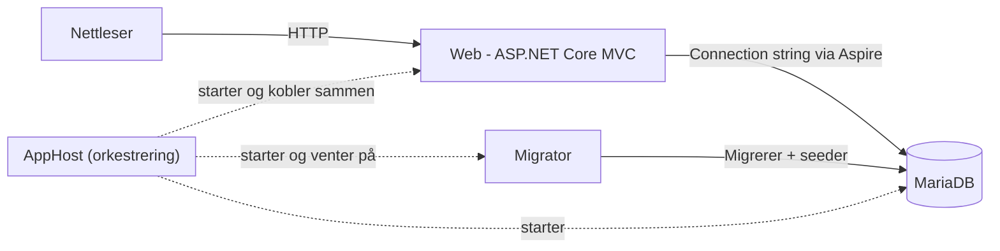

# Arkitektur

> **Status:** Request flow og arkitekturvalgene under er basert på den
> faktiske koden for Need, Resource, Migrator og alle tre `.csproj`-filer
> (Web, AppHost, Migrator). Gjenstående TODO: erstatt arkitekturdiagrammet
> under med et eventuelt eksisterende diagram fra teamet.

## Komponentoversikt

| Komponent | Ansvar |
|---|---|
| **AppHost** | Orkestrerer og starter de andre komponentene lokalt via .NET Aspire (Web, Migrator, MariaDB). |
| **Web** (`Heimevernet`) | ASP.NET Core MVC-applikasjonen. Viser skjema/oversikt og håndterer GET/POST. |
| **Migrator** (`Heimevernet.Migrator`) | Kjører databasemigreringer og legger inn seed-data (f.eks. kategorier) ved oppstart. |
| **MariaDB** | Databasen. Startes som Docker-container av AppHost. |

### Arkitekturdiagram



*(TODO: erstatt med det faktiske diagrammet dere allerede har laget, hvis dere
har et fra før.)*

### Hvordan komponentene kommuniserer

- **Aspire service discovery:** AppHost setter opp referanser mellom
  komponentene (`WithReference(mariadb)`), slik at Web og Migrator får riktig
  connection string uten at den er hardkodet i `appsettings.json`.
- **Rekkefølge ved oppstart:** Migrator venter på at MariaDB er klar
  (`WaitFor(mariadb)`). Web venter på at Migrator er helt ferdig
  (`WaitForCompletion(migrator)`) før den starter, slik at tabeller og
  seed-data finnes før appen tar imot trafikk.

```csharp
var mariadb = builder.AddMySql("mariadb", password: mariadbPassword, port: 3307)
    .AddDatabase("heimevernetdb");

var migrator = builder.AddProject<Projects.Heimevernet_Migrator>("migrator")
    .WithReference(mariadb)
    .WaitFor(mariadb);

builder.AddProject<Projects.Heimevernet>("heimevernet")
    .WithReference(mariadb)
    .WaitFor(mariadb)
    .WaitForCompletion(migrator);
```

## Request flow

Standard flyt for en request i applikasjonen:

```
Browser
  ↓
View (Razor)          – sender skjema/forespørsel
  ↓
Controller             – mottar HTTP-request, model binding
  ↓
Service                – forretningslogikk, mapping, orkestrerer repository + unit of work
  ↓
Repository              – dataaksess via Entity Framework Core (AppDbContext)
  ↓
Database (MariaDB)
```

Returflyt:

```
Database
  ↓
Repository              – returnerer entiteter (f.eks. Need med Category inkludert)
  ↓
Service                – mapper entiteter til ViewModels via Mapper
  ↓
Controller             – returnerer View eller redirect
  ↓
View
```

### Ansvar per lag

- **View** – Viser data til brukeren og sender requests/forms.
- **Controller** – Mottar HTTP-requesten, håndterer input/model binding og
  kaller riktig service. Returnerer en View eller redirect.
- **Service** – Inneholder applikasjons-/forretningslogikk, kaller
  **Mapper** for å konvertere mellom ViewModel og domenemodell, og bruker
  **Repository** + **UnitOfWork** for å lese/skrive data.
- **Mapper** – Eget lag (`Heimevernet/Mappers/`) som konverterer mellom
  domenemodeller (`Need`, `Resource`, …) og ViewModels
  (`NeedViewModel`, `NeedSummaryViewModel`, `NeedCreateViewModel`, …).
  Skilt ut som egen klasse per entitet (f.eks. `INeedMapper`/`NeedMapper`)
  fremfor å gjøre mappingen inne i service- eller controller-laget.
- **Repository** – Håndterer dataaksess og kommuniserer med Entity Framework
  Core (`AppDbContext`). Returnerer domenemodeller, ikke ViewModels.
- **UnitOfWork** – Tynt lag (`IUnitOfWork`/`UnitOfWork`) som wrapper
  `AppDbContext.SaveChangesAsync()`. Repository-metoder som `AddAsync` legger
  bare entiteten til i konteksten; selve lagringen (commit) skjer først når
  service-laget kaller `_unitOfWork.CommitAsync()`. Dette gjør det mulig å
  koordinere flere repository-operasjoner i én transaksjon fra service-laget,
  uten at hver enkelt repository-metode lagrer for seg selv.
- **Database** – MariaDB lagrer de persistente dataene.

### Eksempel: Opprette et behov (Need)

Konkret flyt basert på `NeedController`, `NeedService`, `NeedRepository`,
`NeedMapper` og `AppDbContext`:

1. Bruker fyller ut skjema (`Views/Need/Create.cshtml`) og trykker send.
2. `NeedController.Create(NeedCreateViewModel model)` (`[HttpPost]`) mottar
   requesten. `[ValidateAntiForgeryToken]` sjekker CSRF-token.
3. `ModelState.IsValid` sjekkes. Er den ugyldig, fylles
   `AvailableCategories` på nytt og skjemaet returneres med feilmeldinger.
4. Er modellen gyldig, kalles `INeedService.CreateAsync(model, userId)`.
   (`userId` er foreløpig hardkodet til `1` i controlleren – se TODO i
   koden, dette må byttes ut når ekte innlogging er på plass.)
5. `NeedService.CreateAsync`:
   - Kaller `INeedMapper.ToEntity(model, userId)`, som bygger en ny
     `Need`-entitet fra ViewModel-feltene (tittel, beskrivelse, koordinater,
     region, prioritet, frist, kontaktpunkt).
   - Kaller `INeedRepository.AddAsync(need)`, som legger entiteten til i
     `AppDbContext` (uten å lagre ennå).
   - Kaller `IUnitOfWork.CommitAsync()`, som kjører
     `AppDbContext.SaveChangesAsync()` og faktisk skriver raden til
     databasen.
6. Controlleren setter en suksessmelding i `TempData` og redirecter til
   `Index` (`RedirectToAction(nameof(Index))`).
7. `Index` henter alle behov via `INeedService.GetAllAsync()`, som kaller
   `INeedRepository.GetAllAsync()` (inkluderer `Category`, sortert på
   prioritet og frist) og mapper resultatet til `NeedViewModel` via
   `INeedMapper.ToViewModels(...)`.

### Eksempel: Opprette en ressurs (Resource)

`ResourceController`/`ResourceService`/`ResourceRepository`/`ResourceMapper`
følger nøyaktig samme mønster som Need-flyten over:

1. `ResourceController.Create(ResourceCreateViewModel model)` (`[HttpPost]`,
   `[ValidateAntiForgeryToken]`) mottar requesten. Skjemaet er forhåndsutfylt
   med `AvailableFrom = DateTime.Now` når GET-siden vises.
2. Ved gyldig modell kalles `IResourceService.CreateAsync(model, userId)`.
   Som i `NeedController` er `userId` foreløpig hardkodet til `1`.
3. `ResourceService.CreateAsync` kaller `IResourceMapper.ToEntity(model, userId)`,
   deretter `IResourceRepository.AddAsync(resource)`, og til slutt
   `IUnitOfWork.CommitAsync()` – identisk mønster med Need.
4. Controlleren setter `TempData["Success"]` og redirecter til `Index`.
5. `Index` og `Details` henter data via service-laget, som mapper
   `Resource`-entiteter (med `Category` inkludert, sortert på `CreatedAt`)
   til `ResourceViewModel` via `ResourceMapper`.

Forskjeller fra Need-flyten:
- `ResourceRepository.GetAllAsync` returnerer `IReadOnlyList<Resource>`
  (Need-repositoriet returnerer `IEnumerable<Need>`), og sorterer på
  `CreatedAt` synkende i stedet for prioritet/frist.
- `HomeController.Index` henter både `NeedService.GetSummariesAsync(...)`
  (sammendrag) og `ResourceService.GetAllAsync(...)` (full liste) til
  forsiden – Need og Resource vises altså med ulik detaljgrad der.
- `Attachment`-opplasting er **ikke implementert** i skjemaet:
  `ResourceCreateViewModel` har ingen `IFormFile`-felt eller tilsvarende for
  vedlegg, selv om `Attachment`-modellen og relasjonen til `Resource`
  finnes i datamodellen (se `docs/database.md`). Vedlegg kan derfor ikke
  lastes opp via `Create`-skjemaet per nå.

## Arkitekturvalg

- **Eget mapping-lag (`INeedMapper`/`NeedMapper`) i stedet for mapping i
  controller eller service:** Gjør det mulig å teste mapping isolert
  (jf. `Heimevernet.UnitTests/Mapping/NeedMapperTests.cs`) og holder
  service-laget fokusert på selve forretningslogikken/orkestreringen.
- **Repository-laget er abstrahert med et interface
  (`INeedRepository`/`NeedRepository`):** Gjør det mulig å teste
  service-laget uten en ekte database, ved å mocke repositoriet (jf.
  `Heimevernet.UnitTests/Services/NeedServiceTests.cs`). Repositoriet er
  eneste sted som snakker direkte med `AppDbContext`.
- **Eget `IUnitOfWork`/`UnitOfWork`-lag:** Skiller "legg til i konteksten"
  (repository) fra "lagre til database" (unit of work). Lar service-laget
  styre når data faktisk committes, uten at hvert repository-kall lagrer for
  seg selv.
- **Enums lagres som string i databasen
  (`.HasConversion<string>()` i `AppDbContext.OnModelCreating`):** Gjør
  verdiene i databasen lesbare (f.eks. `"Urgent"` i stedet for `0`) fremfor
  rå heltall, på bekostning av litt mer lagringsplass.
- **`DeleteBehavior.Restrict` på `Match.MatchedByUser` og
  `Attachment.UploadedByUser`:** `Match` refereres fra tre steder (`Need`,
  `Resource` og `User` via `MatchedByUser`), og `Attachment` fra to
  (`Resource` og `User` via `UploadedByUser`). Uten `Restrict` ville EF Core
  forsøke å sette opp flere cascade-slette-stier til samme tabell, noe
  MariaDB (i likhet med SQL Server) ikke tillater. `Restrict` betyr i
  praksis at en `User` ikke kan slettes hvis vedkommende har opprettet
  matcher eller lastet opp vedlegg, med mindre disse håndteres eksplisitt
  først.
- **Unik indeks på `(NeedId, ResourceId)` i `Match`:** Hindrer at samme
  behov og samme ressurs kobles sammen med mer enn én `Match`-rad, håndhevet
  på databasenivå fremfor bare i applikasjonskoden.
- **Migrator kjører migreringer og seeding automatisk ved oppstart:**
  `Heimevernet.Migrator/Program.cs` kaller `db.Database.MigrateAsync()`
  etterfulgt av `SeedData.SeedAsync(db, ...)` hver gang den startes. Dette
  gjør oppstart forutsigbar for nye utviklere – de trenger ikke kjøre
  migreringer eller seede data manuelt. `SeedData.SeedAsync` er idempotent
  (sjekker `FirstOrDefaultAsync`/`AnyAsync` før den legger til), så den kan
  trygt kjøres på nytt uten å duplisere data. Den seeder konkret:
  - Tre brukere: `ola` og `kari` (`UserRole.ResourceProvider`,
    `ActorType: "Private"`) og `public-actor`
    (`UserRole.PublicActor`, `ActorType: "Public Authority"`). Alle har
    passordet `"dev-seed-password"` og er kun ment for utvikling/testing –
    **ikke** ekte autentisering.
  - Tre kategorier: `Equipment` og `Transport` (gjelder både Need og
    Resource), `Personnel` (gjelder kun Need).
  - To eksempel-ressurser (traktor, drone) og to eksempel-behov (transport,
    luftobservasjon), alle plassert i Kristiansand-området (koordinater
    rundt 58.15° N, 7.99–8.02° Ø).
- **Både Web (`Heimevernet`) og Migrator bruker .NET 10**
  (`<TargetFramework>net10.0</TargetFramework>` i begge `.csproj`-filer),
  med EF Core 9.0.2 og Pomelo-provideren for MySQL/MariaDB 9.0.0
  (`Pomelo.EntityFrameworkCore.MySql`). Dette er reflektert i
  "Forutsetninger" i README.
- **Både `Heimevernet.csproj` og `Heimevernet.AppHost.csproj` har hver sin
  egen `UserSecretsId`** (henholdsvis `2c937a63-...` og `2e6d7293-...`).
  Dette bekrefter at `dotnet user-secrets set
  "Parameters:mariadb-password" ... --project Heimevernet.AppHost`
  (se README, "Kom i gang") fungerer direkte uten at noen først må kjøre
  `dotnet user-secrets init` – secrets-lagringen er allerede koblet til
  riktig prosjekt.
- **AppHost bruker Aspire 13.5.3** (`Aspire.AppHost.Sdk/13.5.3` og
  `Aspire.Hosting.MySql` 13.5.3), samme `net10.0` som Web og Migrator. Alle
  tre prosjekter er dermed på samme .NET-versjon.
- **Ingen autorisering/claims er implementert i kontrollerne per nå:**
  Verken `HomeController`, `NeedController` eller `ResourceController` har
  `[Authorize]`-attributter eller rollesjekker mot `UserRole.PublicActor`/
  `ResourceProvider`. Alle sider er foreløpig åpne, og `userId` er
  hardkodet til `1` begge steder de brukes (se egen TODO under). Dette bør
  på plass før innlevering, siden oppgaveteksten krever "sikker innlogging
  og autentisering" med rolleskille.
- **`userId` er hardkodet i både `NeedController` og `ResourceController`:**
  Begge har `var userId = 1; // Replace with authenticated user's ID.` Dette
  betyr at alle behov og ressurser i praksis registreres på samme bruker
  inntil ekte innlogging er koblet på. Bør følges opp som egen oppgave.
- **Vedlegg (Attachments) mangler i skjemaet:** Datamodellen støtter at en
  `Resource` kan ha flere `Attachment`, men `ResourceCreateViewModel` og
  `ResourceController.Create` har ingen felt eller logikk for filopplasting.
  Dette må enten bygges (nytt `IFormFile`-felt i ViewModel, lagring av fil +
  `Attachment`-rad i `ResourceService.CreateAsync`), eller tas bevisst bort
  som et krav hvis det ikke skal prioriteres.
- **Databasebruker:** `AppHost.cs` setter kun opp ett passord
  (`mariadb-password`) via `AddMySql(...)`, og oppretter ingen egen
  app-bruker separat fra dette. I praksis kobler både Web og Migrator seg
  til med standardbrukeren MariaDB-imaget oppretter (root), autentisert med
  det passordet som settes via `dotnet user-secrets`. Det er ikke satt opp
  en begrenset app-bruker med redusert tilgang. Dette er en rimelig
  forenkling for et lokalt utviklingsoppsett, men bør nevnes som en kjent
  begrensning hvis det spørres om i vurderingen.
