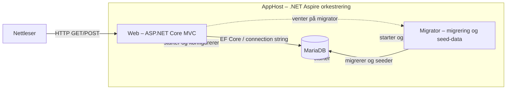

# Arkitektur

Dette dokumentet beskriver arkitekturen som faktisk brukes i prosjektet.
Løsningen består av en ASP.NET Core MVC-webapplikasjon, en migrator og en
MariaDB-database. .NET Aspire AppHost orkestrerer komponentene lokalt.

## Komponentoversikt

| Komponent | Ansvar |
|---|---|
| **AppHost** | Orkestrerer og starter Web, Migrator og MariaDB lokalt via .NET Aspire. |
| **Web** (`Heimevernet`) | ASP.NET Core MVC-applikasjonen som viser sider, mottar GET/POST og returnerer Razor Views. |
| **Migrator** (`Heimevernet.Migrator`) | Kjører EF Core-migreringer og legger inn nødvendig seed-data ved oppstart. |
| **MariaDB** | Lagrer brukere, behov, ressurser, kategorier, matcher og vedlegg. Databasen startes som container av AppHost. |
| **Nettleser** | Brukergrensesnittet som sender HTTP-forespørsler til Web-applikasjonen. |

## Arkitekturdiagram



Diagrammet er laget i Mermaid slik at det kan leses direkte på GitHub og holdes
oppdatert sammen med kildekoden.

## Hvordan komponentene kommuniserer

- **AppHost** oppretter MariaDB-ressursen og referanser til Web og Migrator.
- **Aspire service discovery** gir Web og Migrator riktig connection string via
  `WithReference(mariadb)`, i stedet for at connection string hardkodes i
  `appsettings.json`.
- **Migrator** venter på at MariaDB er klar med `WaitFor(mariadb)`, kjører
  migreringer og legger inn seed-data.
- **Web** venter på MariaDB og på at Migrator er ferdig med
  `WaitForCompletion(migrator)`. Dermed er tabeller og seed-data klare før
  applikasjonen tar imot trafikk.

```csharp
var mariadb = builder.AddMySql("mariadb", password: mariadbPassword, port: 3307)
    .AddDatabase("heimevernetdb");

var migrator = builder.AddProject<Projects.Heimevernet_Migrator>("migrator")
    .WithReference(mariadb)
    .WaitFor(mariadb);

builder.AddProject<Projects.Heimevernet>("heimevernet")
    .WithReference(mariadb)
    .WaitFor(mariadb)
    .WaitForCompletion(migrator);
```

## Request flow

En vanlig forespørsel går gjennom lagene på denne måten:

```text
Nettleser
  ↓ HTTP GET/POST
View (Razor)
  ↓ skjema eller lenke
Controller
  ↓ model binding og validering
Service
  ↓ forretningslogikk
Mapper
  ↓ ViewModel ↔ domenemodell
Repository
  ↓ Entity Framework Core / AppDbContext
MariaDB
```

Returflyten går motsatt vei:

```text
MariaDB → Repository → Service/Mapper → Controller → View → Nettleser
```

### Ansvar per lag

- **View:** Viser dynamisk innhold og sender skjemaer eller lenker.
- **Controller:** Mottar HTTP-requesten, håndterer model binding og validering,
  kaller riktig service og returnerer en View eller redirect.
- **Service:** Inneholder applikasjons- og forretningslogikk og koordinerer
  mapper, repository og Unit of Work.
- **Mapper:** Konverterer mellom domenemodeller som `Need` og `Resource` og
  ViewModels som brukes av brukergrensesnittet.
- **Repository:** Håndterer dataaksess gjennom EF Core og returnerer
  domenemodeller, ikke ViewModels.
- **Unit of Work:** Samler lagring og kaller `SaveChangesAsync()` når service-
  laget har fullført operasjonen.
- **Database:** MariaDB lagrer data permanent mellom forespørsler.

## Eksempel: opprette et behov

1. Brukeren åpner `Create` med GET og får et Razor-skjema.
2. Brukeren fyller inn tittel, beskrivelse, kategori, posisjon og øvrige felt.
3. POST-actionen i `NeedController` mottar `NeedCreateViewModel`.
4. `ModelState.IsValid` kontrolleres. Ved feil returneres skjemaet med
   valideringsmeldinger.
5. Ved gyldige data bruker `NeedService` `NeedMapper` til å lage en `Need`-
   entitet, sender den til `NeedRepository` og committer via `UnitOfWork`.
6. Controlleren redirecter til oversikten.
7. Oversikten henter data fra service/repository og mapper resultatet tilbake til
   ViewModels før Razor View viser det til brukeren.

## Eksempel: opprette en ressurs

`ResourceController` følger samme mønster. GET viser skjemaet, og POST mottar
`ResourceCreateViewModel`, validerer data, mapper til en `Resource`, lagrer via
repository og Unit of Work og redirecter deretter til ressursoversikten.

Ressurser og behov inneholder geografiske koordinater. Kartet vises i
brukergrensesnittet, mens koordinatene sendes som skjemadata til serveren og
lagres sammen med entiteten.

## Arkitekturvalg

- **ASP.NET Core MVC:** Passer til server-renderte skjemaer, tydelig GET/POST-
  flyt og Razor Views.
- **ViewModels:** Hindrer at domenemodeller brukes direkte som input i alle
  Views og gjør validering av brukerdata tydelig.
- **Service- og repository-lag:** Holder HTTP-håndtering, forretningslogikk og
  databaseaksess adskilt og gjør service- og mapper-kode enklere å teste.
- **Mapper-lag:** Samler konvertering mellom ViewModels og domenemodeller i egne
  klasser i stedet for å spre mapping i controllere.
- **Unit of Work:** Gjør det mulig å samle flere databaseendringer før de
  committes.
- **.NET Aspire:** Forenkler lokal orkestrering av Web, Migrator og MariaDB og
  holder connection strings utenfor vanlig kildekode.
- **Migrator med idempotent seed-data:** Nye utviklere får tabeller og
  eksempeldata automatisk ved oppstart uten å kjøre migreringer manuelt.
- **Enums som tekst:** Statusverdier lagres som lesbar tekst i databasen, noe
  som gjør dataene enklere å forstå ved inspeksjon.

## Kjente begrensninger

- Autentisering og autorisering er under utvikling. Controllerne bruker derfor
  foreløpig ikke full claims-basert tilgangskontroll.
- `userId` er foreløpig satt til en utviklingsverdi i opprettelsesflyten og må
  kobles til innlogget bruker når autentisering er ferdig.
- Vedleggsmodellen finnes, men filopplasting i opprettelsesskjemaet er ikke
  ferdig implementert.

Disse punktene beskriver nåværende status og skal ikke leses som ferdige
funksjoner.
