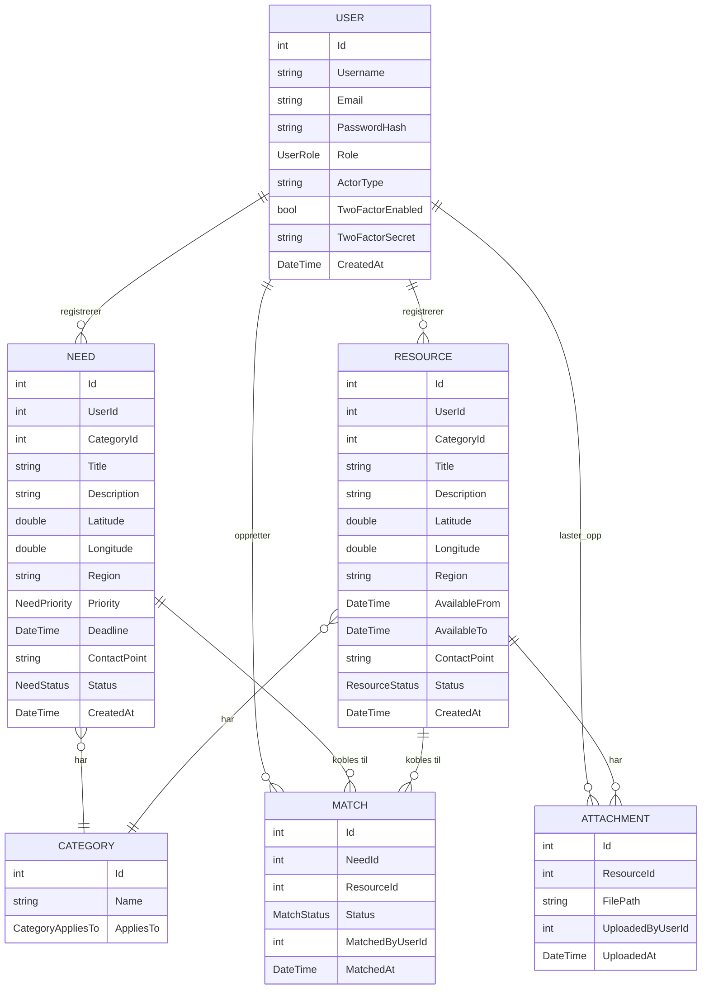

# Database

> **Status:** Datamodellen under er basert på de faktiske klassene i
> `Heimevernet/Models/`. Tilkoblingsdetaljer (bruker, faktisk port/passord i
> produksjon) bør dobbeltsjekkes av den som satte opp `AppHost.cs`.

## Database-tilkobling

Databasen startes av .NET Aspire som en MariaDB-container:

```csharp
var mariadb = builder.AddMySql("mariadb", password: mariadbPassword, port: 3307)
    .WithImage("mariadb", "11")
    .AddDatabase("heimevernetdb");
```

- **Host:** `localhost`
- **Port:** `3307`
- **Databasenavn:** `heimevernetdb`
- **Bruker:** `root` (MariaDB-imagets standardbruker). Det er ikke satt opp
  en egen, begrenset app-bruker – se `docs/architecture.md` for detaljer.
- **Passord:** Settes lokalt via:
  ```bash
  dotnet user-secrets set "Parameters:mariadb-password" "<passord>" --project Heimevernet.AppHost
  ```
  Passordet er ikke fast og deles ikke i repoet.

For å koble til med et eksternt databaseverktøy (f.eks. DBeaver, MySQL
Workbench, Azure Data Studio):

1. Start prosjektet minst én gang (`dotnet run` fra `Heimevernet.AppHost`),
   slik at containeren kjører.
2. Koble til `localhost:3307` med brukernavn og passordet du satte med
   `user-secrets`.
3. Velg databasen `heimevernetdb`.

## Datamodell



### Tabeller

- **Users** – applikasjonens brukere. Har en `Role`
  (`PublicActor`/`ResourceProvider`), et fritekstfelt `ActorType` (f.eks.
  "Kommune", "Bedrift", "Frivillig organisasjon" – jf. intressentlisten i
  oppgaveteksten), og felter for tofaktorautentisering
  (`TwoFactorEnabled`, `TwoFactorSecret`).
- **Needs** – behov registrert av en offentlig aktør (`User`). Har
  geografisk plassering (`Latitude`/`Longitude`, `Region`), en `Priority`
  (Urgent/Planned), en frist (`Deadline`), kontaktpunkt og en egen
  `NeedStatus`.
- **Resources** – ressurser registrert av en ressursleverandør (`User`). Har
  tilsvarende geografisk plassering, et tilgjengelighetsvindu
  (`AvailableFrom`/`AvailableTo`), kontaktpunkt og en egen `ResourceStatus`.
  Kan ha flere `Attachment` (bilder/filer).
- **Categories** – kategorier som kan gjelde `Need`, `Resource` eller begge
  (`CategoryAppliesTo`). Seedet av Migrator (`SeedData.cs`) med tre
  kategorier: `Equipment` og `Transport` (gjelder begge), `Personnel`
  (gjelder kun Need).
- **Attachments** – filer/bilder knyttet til én `Resource`, med referanse til
  hvem som lastet den opp.
- **Matches** – se eget avsnitt under.

### Matches

En `Match` representerer en foreslått eller bekreftet kobling mellom **ett
konkret behov** (`NeedId`) og **én konkret ressurs** (`ResourceId`). Den
lagrer også hvem som opprettet koblingen (`MatchedByUserId`) og når
(`MatchedAt`).

En `Match` har sin egen `MatchStatus`
(`UnderReview` → `Assigned` → `Resolved`), uavhengig av statusen til behovet
og ressursen den kobler sammen. Det gjør at man kan spore fremdriften på
selve koblingen (blir denne konkrete ressursen faktisk brukt til dette
konkrete behovet?) separat fra fremdriften på behovet eller ressursen som
helhet – et behov kan for eksempel ha flere foreslåtte matcher samtidig, med
ulik status på hver.

## Statusfelt

Prosjektet har tre separate statusfelt, definert i `Enums.cs`:

| Entitet | Enum | Verdier |
|---|---|---|
| **Need** | `NeedStatus` | `New` → `UnderReview` → `Assigned` → `Resolved` |
| **Resource** | `ResourceStatus` | `Available` ↔ `Busy` |
| **Match** | `MatchStatus` | `UnderReview` → `Assigned` → `Resolved` |

Disse er separate fordi et behov, en ressurs og en konkret kobling (match)
mellom dem kan være i ulik tilstand samtidig:

- Et **behov** kan stå som `Assigned` (en ressurs er funnet for det) selv om
  den konkrete `Match`-en fortsatt er `UnderReview` og ikke er bekreftet
  ennå.
- En **ressurs** kan være `Busy` fordi den er bundet opp i én match, samtidig
  som behovet den er koblet til fortsatt venter (`UnderReview`).
- En ressurs med status `Available` kan i prinsippet inngå i flere foreslåtte
  matcher samtidig, hver med sin egen `MatchStatus`, før én av dem bekreftes.

Med andre ord: `NeedStatus` og `ResourceStatus` beskriver den overordnede
tilstanden til behovet/ressursen sett isolert, mens `MatchStatus` beskriver
fremdriften på den spesifikke koblingen mellom to av dem. Verken
`NeedService` eller `ResourceService` inneholder per nå logikk som
automatisk oppdaterer `NeedStatus`/`ResourceStatus` når en tilhørende
`Match` endrer status – de to servicene har foreløpig kun `CreateAsync`,
`GetAllAsync`/`GetSummariesAsync` og `GetByIdAsync`, ingen
oppdateringsmetode. En eventuell kobling mellom `MatchStatus` og de andre
statusfeltene må enten bygges, eller gjøres manuelt av brukeren via en
fremtidig "oppdater status"-funksjon.

**Merk:** `Enums.cs` inneholder også `UserRole` (`PublicActor`,
`ResourceProvider` – med en kommentar om at `Admin` kanskje legges til
senere), `NeedPriority` (`Urgent`, `Planned`) og `CategoryAppliesTo` (`Need`,
`Resource`, `Both`), men disse er ikke statusfelt i samme forstand.
